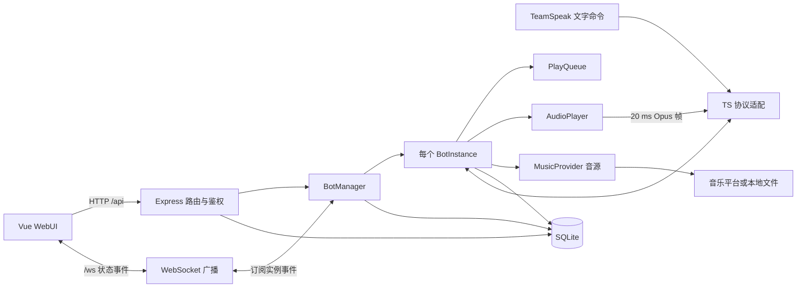

# TSMusicBot 架构与维护指南

本文描述当前仓库的实现方式，供后续开发、排障和代码评审使用。用户安装与功能说明见 [README.md](README.md)。代码是最终依据；修改跨模块行为时，请同时更新本文相关章节。

## 1. 总体结构

项目由一个 Node.js/TypeScript 后端进程和一个 Vue 3 单页前端组成。后端同时运行 HTTP/WebSocket 服务、多个 TeamSpeak 可见客户端，以及按需启用的音乐源服务。多个机器人共用音乐源对象和数据库连接，但各自拥有连接、队列、播放器和播放状态。

主要依赖方向是：入口装配各组件；Web 路由和 TeamSpeak 文字命令调用机器人能力；`BotInstance` 协调队列、音源、音频与 TS 连接；`data` 层负责持久化。WebSocket 订阅机器人事件并广播状态，前端不通过 WebSocket 发控制命令。

## 2. 目录与职责

| 位置 | 职责与优先查看的文件 |
| --- | --- |
| `src/index.ts` | 进程入口、数据目录、依赖装配、启动与关闭顺序。 |
| `src/bot/manager.ts` | 机器人集合；创建、移除、启停、从数据库恢复；共享音源和受管语音客户端登记。 |
| `src/bot/instance.ts` | 单个机器人的运行时协调：TS 事件、文字命令、队列、播放、自动暂停、资料更新、语音请求、快照。 |
| `src/bot/commands.ts`、`song-ref.ts` | 文字命令解析、权限判断及歌曲/歌单引用解析。 |
| `src/bot/voice-request.ts`、`voice-worker.ts`、`voice-models.ts` | 频道语音包解码、离线唤醒/识别工作线程、模型路径与唤醒词。 |
| `src/audio/queue.ts` | 顺序、单曲循环、随机、随机循环模式及队列游标；纯队列逻辑。 |
| `src/audio/player.ts`、`encoder.ts` | FFmpeg 解码、PCM 缓冲、音量处理、20 ms 帧调度和 Opus 编码。 |
| `src/ts-protocol/client.ts` | 可见 TS 客户端封装、TS3/TS6 检测、语音包与消息事件；`http-query.ts` 处理 TS6 HTTP Query。 |
| `src/music/provider.ts`、各音源文件 | `MusicProvider` 契约及网易云、QQ、酷狗、B 站、YouTube、本地文件、Jellyfin、Spotify 适配。`api-server.ts` 管理网易云/QQ 内嵌 API 服务。 |
| `src/music/spotify/` | Spotify 授权、Connect 控制和外部音频后端；生命周期与普通 URL 音源不同。 |
| `src/data/` | 配置、SQLite 表/迁移及访问接口、用户/会话/权限/审计、Cookie 与头像文件。 |
| `src/web/server.ts`、`api/`、`middleware/`、`websocket.ts` | HTTP 装配、业务路由、鉴权授权、CSRF、实时状态广播。 |
| `web/src/router/`、`stores/`、`composables/`、`views/` | 前端路由、Pinia 播放状态、会话/WebSocket 逻辑和页面。 |
| `scripts/` | 安装、原生模块检查、Docker 和手动集成验证脚本。 |

## 3. 启动与生命周期

`src/index.ts` 依次执行：迁移旧位置的配置文件 → 加载并规范化配置 → 创建日志与 SQLite → 启动已启用的网易云/QQ 内嵌 API 服务 → 创建并配置各音乐源和 Cookie/OAuth 存储 → 创建 `BotManager` 并加载已保存机器人 → 启动 Express/WebSocket。`autoStart` 机器人在加载时异步连接，连接间隔 1 秒。收到 `SIGINT`/`SIGTERM` 时依次关闭机器人、Web 服务、内嵌 API 服务和数据库。

`BotManager` 持有 `Map<botId, BotInstance>`。`startBot()` 会断开旧实例、读取最新数据库配置、创建新实例并连接；因此外部订阅者不能长期缓存旧实例引用。`BotManager` 发出 `botInstance` / `botInstanceRemoved` 事件，`src/web/websocket.ts` 据此重新绑定监听器。连接成功后持久化 TS 身份，以保留服务器组。修改机器人连接参数后，需要重新启动该机器人才能让运行中的连接采用新参数。

每个 `BotInstance` 拥有自己的 `TS3Client`、`AudioPlayer`、`PlayQueue`、Spotify 控制器及状态。普通断开/重连会清理运行时资源；若启用了队列保存，断开前保留的快照用于下次连接恢复。新增定时器、子进程或事件监听器时，必须在相应断开和进程关闭路径释放。

## 4. 主要请求和播放数据流

### WebUI 控制

1. 前端通过 `/api/session/*` 建立 Cookie 会话。其他 `/api/*` 请求先经过来源检查和会话校验，再由路由执行能力及机器人作用域校验。
2. 例如点歌请求进入 `src/web/api/player.ts`，找到目标 `BotInstance`，调用其播放/入队方法。TS 文字命令则从 `TS3Client` 的消息事件进入 `BotInstance`，经 `commands.ts` 解析后调用同一实例的操作逻辑。
3. 队列改变和播放器事件触发 `stateChange`；`src/web/websocket.ts` 发送目标机器人状态及队列。前端 `useWebSocket.ts` 更新 `stores/player.ts`，并在重连时接收 `init` 快照。

### 一首歌的播放

1. 搜索/歌单阶段由 `MusicProvider` 返回歌曲元数据；队列保存元数据，播放前再调用相应源的 `getSongUrl()` 解析有效链接。
2. `BotInstance.resolveAndPlay()` 选择源、处理不可播放歌曲并启动播放器。普通音源由 `AudioPlayer` 启动 FFmpeg，解码为 48 kHz、双声道、16 位 PCM；播放器按 20 ms 取帧，编码为 Opus 并发出 `frame`。
3. `BotInstance` 将 `frame` 转交 `TS3Client.sendVoiceData()`。曲目结束或出错时，播放器事件推动 `playNext()`。Spotify 使用独立的 Connect/外部 PCM 路径，曲目结束由 Spotify 控制器事件推进，不能直接套用普通流的 EOF 逻辑。
4. `PlayQueue` 决定下一首、上一首及播放模式；播放历史、资料更新、歌词和播放状态由 `BotInstance` 协调。

音源通用模型定义在 `src/music/provider.ts`。`Song.id` 是字符串，Jellyfin 等源可能使用非数字 ID。队列快照故意不持久化 `url`，重启后需重新解析；已恢复的当前曲目从头播放，不恢复秒级进度。

### 频道语音点歌（离线识别）

该功能默认关闭。模型由 `npm run setup:voice` 下载到 `data/voice-models/`；`src/bot/voice-models.ts` 定义模型文件路径和唤醒词“布鲁斯布鲁斯”。`GET /api/bot/settings` 返回 `voiceRequest.modelsReady`，`POST /api/bot/settings` 在启用前检查模型，并把 `voiceRequest.enabled` 写入配置、实时通知所有机器人。设置页入口在 `web/src/views/Settings.vue`。

1. `src/ts-protocol/client.ts` 接收频道成员的 Opus 包，发出 `voiceActivity`；仅在语音点歌启用时复制音频数据并发出 `voiceData`。`BotInstance` 排除自身和其他受管机器人，再把包交给 `VoiceRequestController`。`voiceActivity` 还用于独立的语音避让功能，两者不要混为一个开关。
2. `VoiceRequestController` 在主线程维护按说话者区分的 Opus 解码器，将 48 kHz 双声道 PCM 转成单声道浮点样本，发送给 `worker_threads` 中的 `voice-worker.ts`。最多保留 8 个说话者的解码状态。
3. 工作线程用 `sherpa-onnx-node` 将音频重采样到 16 kHz，执行关键词检测；听到“布鲁斯布鲁斯”后只接收该说话者随后的一句指令。唤醒时机器人播放短提示音。线程用 VAD 切出语句，再运行本地离线识别；超时、短语音或模型错误会返回失败事件。
4. `parseVoiceCommand()` 接受点歌、暂停、继续、上一首和下一首。`BotInstance.handleVoicePlayRequest()` 把识别结果转换成现有 `play` / `pause` / `resume` / `prev` / `next` 命令，经 `executeCommand()` 走原有播放逻辑，并在 TS 频道发送文字反馈。语音识别在本机完成，搜索与获取歌曲仍依赖对应音源。

连接或热更新开关时启动/停止工作线程；断开、说话者离开、切换频道时清理或取消相关识别状态。改动该功能时同时检查 `src/bot/voice-request.test.ts`、设置 API 的模型校验、提示音与播放帧调度，避免识别计算阻塞音频输出。用户启用步骤和口令示例见 [README 的频道语音点歌章节](README.md#频道语音点歌离线识别)。

## 5. 配置与持久化

运行数据位于项目根目录的 `data/`；Docker 把 `/app/data` 挂载为持久卷。

| 数据 | 位置与规则 |
| --- | --- |
| 全局配置 | `data/config.json`；结构和默认值在 `src/data/config.ts`。旧根目录 `config.json` 启动时迁移。加载时规范化，保存后部分设置可实时生效，部分需要重启相关服务。 |
| 关系数据 | `data/tsmusicbot.db`，SQLite WAL；建表及增量迁移在 `src/data/database.ts`。包含机器人配置/身份、播放历史、用户、会话、权限、收藏、已存队列和实时队列快照。 |
| 平台凭据 | `data/cookies/` 保存共享平台登录；个人网易云 Cookie 在 `user_music_cookies` 表；Spotify OAuth 文件在 `data/spotify/`。这些内容属于秘密数据。 |
| 文件资产 | `data/avatars/`、`data/local-audio/`、`data/logs/`。本地上传文件清理要考虑所有机器人的队列引用。 |

`enabledProviders` 控制常规在线音源和 Jellyfin；`localAudioEnabled`、`spotify.enabled` 使用各自的开关。网易云/QQ 内嵌 API 服务只在启动时按配置选择是否监听，因此改动这两个源的启用状态后需重启进程。队列保存/恢复由 `savedQueuesEnabled` 控制：状态改变后防抖写入 `queue_state`，连接时恢复。手动保存的清单在 `saved_queues`，与运行队列快照是两种数据。

数据库变更应在 `initTables()` 中定义新安装的表结构，并在 `migrateSchema()` 或明确的一次性迁移中覆盖旧库。保留既有数据，给迁移补充 `src/data/*.test.ts` 测试。

## 6. 安全边界

`src/web/server.ts` 中，`/api/health`、公开 URL 配置和会话入口先注册；其余 `/api` 统一经过 `csrfOriginCheck`、`createRequireAuth`。各路由再使用 `requireAdmin`、`requireNotGuest`、`requirePermission`、`requireBotAccess` 或 `authorize`。管理员有全局权限；成员按能力及机器人白名单授权；游客还受独立权限开关和机器人范围限制。前端路由守卫只改善导航体验，不能替代后端校验。

`/ws` 在 HTTP upgrade 时校验 Origin 与会话 Cookie，游客连接按可见机器人过滤；管理员修改游客策略时，现有游客连接会被关闭或重新限定范围。新增状态事件时必须继续遵守目标机器人可见范围，避免把受限机器人的数据发给游客。

新增 API 时，应同时检查：是否需要登录、写操作的 CSRF、成员能力、游客权限、机器人作用域、返回字段中的凭据，以及现有会话失效后的前端行为。涉及用户或权限修改时，沿用 `src/data/audit.ts` 的审计路径。

## 7. 常见扩展步骤

### 增加音乐源

1. 在 `src/music/provider.ts` 扩展 `Platform` 并实现 `MusicProvider`；无法支持的可选能力按接口约定处理。
2. 更新 `src/data/config.ts` 的启用门控、默认源和配置读写；在 `src/index.ts` 装配实例，并传入 `BotManager` / `createWebServer`。
3. 更新 `BotInstance.getProviderFor()`、搜索/浏览 API、前端的源类型、标签与可见性。若需登录，接入 `src/music/auth.ts`、`src/web/api/auth.ts` 和凭据持久化。
4. 增加源级测试及至少一条从入队到解析播放的验证。对直播流或外部音频后端，先确认结束事件、跳转和清理语义。

### 增加播放操作或页面

优先在 `BotInstance` 中形成可复用的操作，再让 Web 路由和文字命令调用它；队列规则留在 `PlayQueue`，音频解码/帧处理留在 `AudioPlayer`。API 变更需补权限测试，并确认 `stateChange` 是否足以同步前端。前端使用 `stores/player.ts` 维护按机器人区分的状态，`router/index.ts` 维护页面访问与专属链接的 `?bot` 作用域。

### 修改设置项

同步修改配置类型、默认值、加载校验、保存逻辑、设置 API 和页面；明确说明实时生效、机器人重启生效还是进程重启生效。若设置改变游客策略，需调用 WebSocket 的策略刷新；若改变音源对象行为，需更新运行中的源实例，而不只是写配置文件。

## 8. 当前维护关注点

- `BotInstance` 和 `web/api/player.ts` 承担较多协调逻辑。扩展时优先抽取可独立验证的状态决策或适配逻辑，避免把队列规则复制到 API、聊天命令和前端。
- `BotManager` 的构造函数接收多项位置参数，并在创建、重启和恢复机器人时分别组装 `BotInstanceOptions`；新增源容易漏掉其中一条路径。评审时逐一核对。
- Spotify 每个机器人的控制端口由 ID 散列到有限区间，散列冲突仍可能导致第二个后端无法监听；相关说明见 `spotifyPortsForBotId()`。多机器人 Spotify 部署需关注启动日志。
- 队列快照不包含已解析 URL 与随机播放历史；恢复是继续播放清单的尽力行为。修改队列结构时检查快照兼容性和本地上传引用清理。
- 前后端分别声明歌曲、机器人状态等 TypeScript 类型。调整接口字段时同步更新两端，并验证 WebSocket `init` / `stateChange` 消息。

## 9. 本地验证

项目根目录执行 `npm test` 运行 Vitest，`npm run build` 编译后端并构建前端。前端构建会先运行 `vue-tsc --noEmit`。按改动范围选择验证：队列/播放器看 `src/audio/*.test.ts`，机器人生命周期看 `src/bot/*.test.ts`，权限和 API 看 `src/web/**/*.test.ts`，配置/迁移看 `src/data/*.test.ts`，前端状态看 `web/src/**/*.test.ts`。TS3/TS6 真机连接、音乐平台网络请求和音频输出仍需对应环境做集成验证；`scripts/` 中有场景脚本可作参考。
